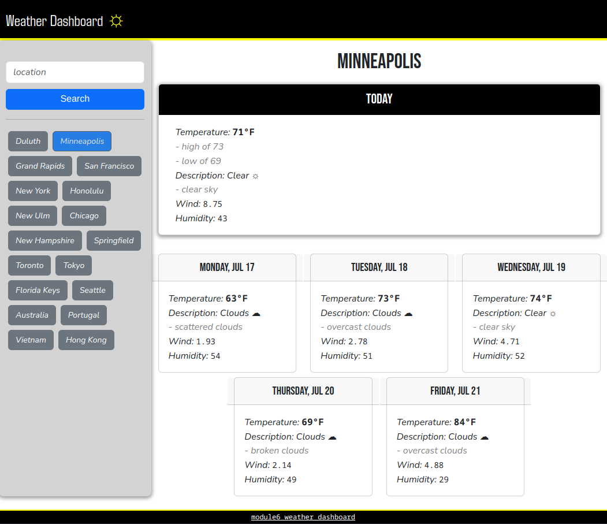

# module6_weather_dashboard
## Description

A weather forecast website that pulls current weather data from openweathermap.
Weather location search history is saved to local storage.
Dates are pulled from fetched weather data and then formatted with dayjs library.
Weather data includes: *temperature (in degrees fahrenheit), description, wind, and humidity*.
Available [here](https://johntg96.github.io/Weather-Dashboard/)
